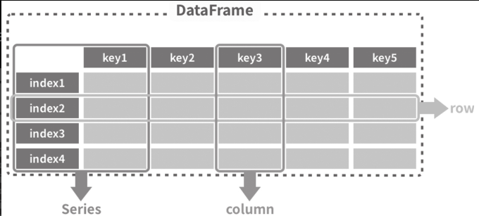
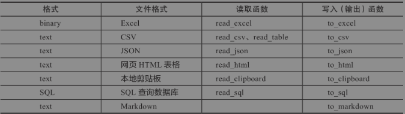

## 目录 
- pandas_test1.ipynb   pandas对excel读取和数据处理api \
- pandas_test2.ipynb   pandas生成数据
- pandas_test3.ipynb   pandas数据清洗
- pandas_test4.ipynb   pandas数据处理案例


### Panadas数据结构

| 名称 | 维度数据 | 描述             |
|----|------|----------------|
|  Series  | 1    | 带标签的一位同结构数组    |
| DataFrame   | 2    | 带标签的大小可变二维异构表格 |


#### - Series
> 带有标签的一位数组
```angular2html
中国  14.34
美国  21.43
日本  5.08
dtype: float64
```
#### - DataFrame
> 数据框，存放数据的框架，横向称为row，纵向成为column




### Panadas数据类型
> #查看各列的数据类型 \
> df.dtypes

Pandas支持读取的数据源


### Pandas索引

> #读取数据时设置索引 \
> df = pd.read_excel(data, index_col='name') \
> #读取时不设索引 \
> df = pd.read_excel(data) \
> df.set_index('name')